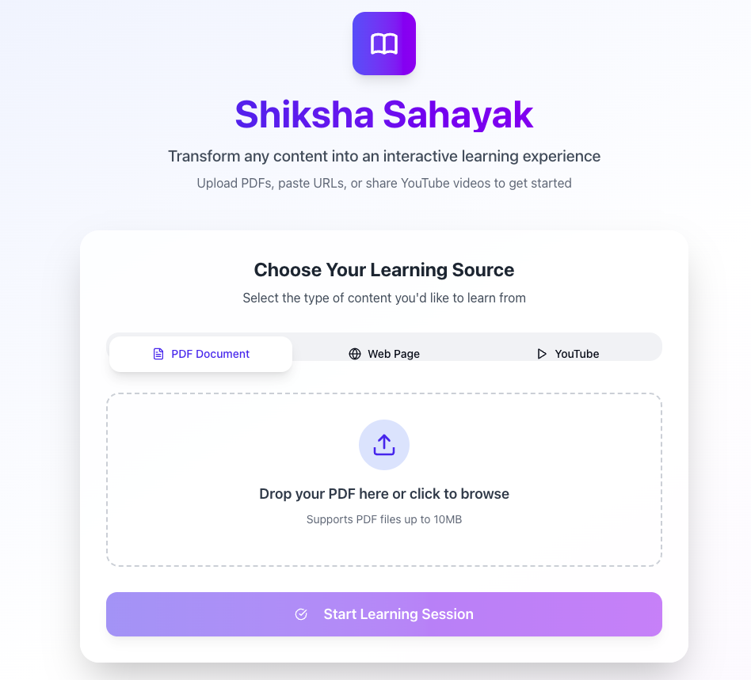

# Shiksha Sahayak - Your AI Learning Assistant



**Shiksha Sahayak** (meaning "Education Assistant") is a full-stack web application that transforms any content—PDFs, websites, or YouTube videos—into a dynamic and interactive learning experience. It leverages a powerful AI backend to provide users with summaries, direct Q&A, and auto-generated quizzes to solidify their understanding.

### 🔴 [**View the Live Demo Here**](https://shikshak-sahayak.vercel.app/)

---

## ✨ Core Features

-   **Multi-Format Content Ingestion**: Start a learning session by providing a:
    -   📄 **PDF Document**: Upload any PDF file.
    -   🌐 **Website URL**: Paste a link to an article, blog, or documentation.
    -   ▶️ **YouTube Video**: Provide a video URL to learn from its transcript.
-   **AI-Powered Chat**: Ask specific, contextual questions about the source material and receive instant, accurate answers.
-   **Automated Summaries**: Get a concise summary of the key points and main ideas from your content with a single click.
-   **Interactive Quizzing**: Test your knowledge with multiple-choice quizzes that are automatically generated based on the content.
-   **Clean, Modern UI**: A fully responsive and intuitive interface designed for a seamless user experience on any device.

---

## 🏛️ Project Architecture

This project is built on a modern, decoupled, two-part architecture: a **Next.js Frontend** and a **FastAPI Backend**. This separation allows for independent development, scaling, and deployment.

-   **Frontend**: A Next.js application serves the user interface. It is responsible for all visual components and for making API calls to the backend. It's designed to be deployed as a standalone Node.js service.

-   **Backend**: A Python-based FastAPI server acts as the application's brain. It exposes a RESTful API and handles all core logic, including the Retrieval-Augmented Generation (RAG) pipeline, interactions with the Google Gemini LLM, and managing user sessions.

-   **Hosting**: Backend services are containerized and deployed on **Google Cloud Platform (GCP)**

---

## 📦 Component Repositories

The complete system is split into two dedicated repositories. Please visit them for detailed technical information, setup instructions, and the source code for each part.

###  Frontend

The frontend is a server-side rendered (SSR) application built with Next.js, providing a fast and responsive user experience.

-   **Repository**: ➡️ [**pyandcpp-coder/Shikshak_Sahayak_Frontend**](https://github.com/pyandcpp-coder/Shikshak_Sahayak_Frontend)
-   **Technology**: Next.js, React, TypeScript, Tailwind CSS, shadcn/ui
-   **Deployment**: Hosted on **Google Cloud Platform**.

### ⚙️ Backend

The backend is a high-performance, asynchronous API built with FastAPI. It handles all the heavy lifting, including document processing, AI model interactions, and the RAG pipeline.

-   **Repository**: ➡️ [**pyandcpp-coder/Shikshak_Sahayak_Backend**](https://github.com/pyandcpp-coder/Shikshak_Sahayak_Backend)
-   **Technology**: FastAPI, Python, LangChain, Google Gemini, ChromaDB
-   **Deployment**: Hosted on **Google Cloud Platform**.

---

## 🚀 How to Run the Entire Project Locally

To run the full application on your local machine, you need to clone and run **both** repositories concurrently.

### 1. Run the Backend

First, set up and start the backend server.

```bash
# Clone the backend repository
git clone https://github.com/pyandcpp-coder/Shikshak_Sahayak_Backend.git
cd Shikshak_Sahayak_Backend

# Create and activate a virtual environment
python -m venv venv
source venv/bin/activate

# Install dependencies
pip install -r requirements.txt

# Create a .env file and add your GOOGLE_API_KEY
echo "GOOGLE_API_KEY='YOUR_API_KEY_HERE'" > .env

# Run the server
uvicorn main:app --reload
```
## Frontend 

```bash
# Clone the frontend repository
git clone https://github.com/pyandcpp-coder/Shikshak_Sahayak_Frontend.git
cd Shikshak_Sahayak_Frontend

# Install dependencies
npm install

# Create a .env.local file pointing to your local backend
echo "NEXT_PUBLIC_API_URL=http://localhost:8000" > .env.local

# Run the development server
npm run dev
```
The frontend will now be available at http://localhost:3000. Open this URL in your browser to use the application.
